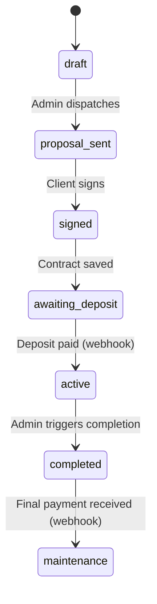

# Studio OS — Implementation Plan

## Executive Summary

Studio OS is a vertically integrated, premium client portal for independent full-stack engineers. It replaces the "Frankenstein workflow" of Google Docs, payment links, WhatsApp screenshots, and Google Drive folders with a single, cryptographically secure environment spanning proposals → payments → feedback → handoff.

This plan breaks the PRD into **three progressive phases** — MVP first, polish second, advanced features third — while embedding security as a first-class architectural concern at every layer.

---

## Tech Stack (Confirmed)

| Layer | Technology | Notes |
|-------|-----------|-------|
| Framework | **Next.js 16** (App Router) | Already scaffolded. Read `node_modules/next/dist/docs/` before coding. |
| Styling | **Tailwind CSS v4** | Already configured via `@tailwindcss/postcss`. |
| Auth | **Clerk** | Handles admin login, client magic-links, multi-tenant orgs, MFA, RBAC. |
| Database & Storage | **Supabase** (PostgreSQL + Storage) | RLS-first multi-tenant isolation. **Auth handled by Clerk, not Supabase Auth.** |
| Payments | **DodoPayments** + Webhooks | Checkout Sessions, Standard Webhooks signature verification. |
| PDF Generation | **Puppeteer** (server-side) | Runs in a sandboxed Node.js API route. |
| Animations | **GSAP** | Micro-interactions, SVG roadmaps. |
| Email | **Resend** or **Clerk built-in** | Transactional emails (magic links handled by Clerk, notifications via Resend). |

---

## Phase Breakdown

### 🟢 Phase 1 — MVP (Current Scope)

> **Goal:** A working end-to-end flow from proposal creation → client review → contract signing → deposit payment → project activation. No iframe staging engine yet.

#### 1.1 Authentication & Multi-Tenant Foundation (Clerk)

- **Admin Auth**: Email + password via Clerk. MFA available out-of-the-box (enable in Phase 2).
- **Client Auth**: Passwordless magic-link via Clerk. Clerk handles token expiry and single-use enforcement automatically.
- **Multi-Tenancy via Clerk Organizations**:
  - Each agency = one Clerk Organization.
  - Admin = `org:admin` role. Client = `org:member` role.
  - Clerk's `clerkMiddleware` + `createRouteMatcher` protects routes at the edge.
  - Supabase RLS policies use the Clerk `user_id` (synced to `profiles.clerk_user_id`) for data isolation.
- **Clerk ↔ Supabase Sync**: On Clerk webhook `user.created`, insert a row into `profiles`. On `organization.created`, insert into `agencies`. This keeps Clerk as the auth source-of-truth and Supabase as the data layer.

**Middleware Setup** (`middleware.ts`):
```typescript
import { clerkMiddleware, createRouteMatcher } from "@clerk/nextjs/server";

const isAdminRoute = createRouteMatcher(['/admin(.*)']);
const isPortalRoute = createRouteMatcher(['/portal(.*)']);
const isWebhookRoute = createRouteMatcher(['/api/webhooks(.*)']);

export default clerkMiddleware(async (auth, req) => {
  if (isWebhookRoute(req)) return; // Webhooks handle their own auth
  if (isAdminRoute(req) || isPortalRoute(req)) {
    await auth.protect();
  }
});
```

**Root Layout** wraps with `<ClerkProvider>`:
```tsx
import { ClerkProvider } from '@clerk/nextjs';

export default function RootLayout({ children }) {
  return (
    <ClerkProvider>
      <html lang="en">
        <body>{children}</body>
      </html>
    </ClerkProvider>
  );
}
```

##### Database Tables (MVP)

```sql
-- Core identity (synced from Clerk)
profiles (
  id UUID PRIMARY KEY DEFAULT gen_random_uuid(),
  clerk_user_id TEXT UNIQUE NOT NULL,  -- Clerk's user ID
  clerk_org_id TEXT,                    -- Clerk's organization ID
  role TEXT CHECK (role IN ('admin','client')) NOT NULL,
  agency_id UUID REFERENCES agencies(id),
  display_name TEXT,
  email TEXT,
  avatar_url TEXT,
  created_at TIMESTAMPTZ DEFAULT now()
)

-- Multi-tenant root (synced from Clerk Organizations)
agencies (
  id UUID PRIMARY KEY DEFAULT gen_random_uuid(),
  clerk_org_id TEXT UNIQUE NOT NULL,   -- Clerk's org ID
  name TEXT NOT NULL,
  owner_id UUID REFERENCES profiles(id),
  brand_config JSONB DEFAULT '{}',
  created_at TIMESTAMPTZ DEFAULT now()
)

-- Project lifecycle
projects (
  id UUID PRIMARY KEY DEFAULT gen_random_uuid(),
  agency_id UUID REFERENCES agencies(id) NOT NULL,
  client_profile_id UUID REFERENCES profiles(id),
  title TEXT NOT NULL,
  status TEXT CHECK (status IN (
    'draft','proposal_sent','signed','awaiting_deposit',
    'active','completed','maintenance'
  )) DEFAULT 'draft',
  current_phase INT DEFAULT 0,
  created_at TIMESTAMPTZ DEFAULT now(),
  updated_at TIMESTAMPTZ DEFAULT now()
)

-- Proposal content
proposals (
  id UUID PRIMARY KEY DEFAULT gen_random_uuid(),
  project_id UUID REFERENCES projects(id) NOT NULL,
  markdown_content TEXT,
  base_price BIGINT NOT NULL,
  currency TEXT DEFAULT 'usd',
  created_at TIMESTAMPTZ DEFAULT now(),
  updated_at TIMESTAMPTZ DEFAULT now()
)

-- Interactive add-ons
proposal_addons (
  id UUID PRIMARY KEY DEFAULT gen_random_uuid(),
  proposal_id UUID REFERENCES proposals(id) NOT NULL,
  label TEXT NOT NULL,
  description TEXT,
  price BIGINT NOT NULL,
  is_selected BOOLEAN DEFAULT false,
  sort_order INT DEFAULT 0
)

-- Signed contracts
contracts (
  id UUID PRIMARY KEY DEFAULT gen_random_uuid(),
  project_id UUID REFERENCES projects(id) NOT NULL,
  proposal_snapshot JSONB NOT NULL,
  selected_addons JSONB NOT NULL,
  total_price BIGINT NOT NULL,
  signature_data TEXT NOT NULL,
  signer_ip INET,
  signed_at TIMESTAMPTZ DEFAULT now(),
  pdf_storage_path TEXT
)

-- DodoPayments integration
payments (
  id UUID PRIMARY KEY DEFAULT gen_random_uuid(),
  project_id UUID REFERENCES projects(id) NOT NULL,
  dodo_checkout_session_id TEXT,
  dodo_payment_id TEXT,
  dodo_product_id TEXT,
  amount BIGINT NOT NULL,
  currency TEXT DEFAULT 'usd',
  type TEXT CHECK (type IN ('deposit','final')) NOT NULL,
  status TEXT CHECK (status IN ('pending','succeeded','failed')) DEFAULT 'pending',
  idempotency_key UUID UNIQUE DEFAULT gen_random_uuid(),
  created_at TIMESTAMPTZ DEFAULT now()
)

-- Webhook dedup (DodoPayments)
dodo_events (
  webhook_id TEXT PRIMARY KEY,         -- from webhook-id header
  event_type TEXT NOT NULL,
  payload_type TEXT,
  processed_at TIMESTAMPTZ DEFAULT now()
)

-- Asset vault
assets (
  id UUID PRIMARY KEY DEFAULT gen_random_uuid(),
  project_id UUID REFERENCES projects(id) NOT NULL,
  uploaded_by UUID REFERENCES profiles(id),
  file_name TEXT NOT NULL,
  storage_path TEXT NOT NULL,
  mime_type TEXT,
  size_bytes BIGINT,
  created_at TIMESTAMPTZ DEFAULT now()
)
```

> [!IMPORTANT]
> All `BIGINT` price fields store **cents** (or smallest currency unit) to avoid floating-point errors. Never store prices as decimals.

#### 1.2 Admin Dashboard

- **Route**: `/admin` (protected by Clerk middleware — requires `org:admin` role)
- **Pages**:
  - `/admin` — Dashboard overview (project list, payment summary stats)
  - `/admin/projects/new` — Create project + draft proposal (markdown editor)
  - `/admin/projects/[id]` — Project detail (status, proposal, payments, assets)
  - `/admin/projects/[id]/proposal` — Proposal editor with add-on toggle builder
  - `/admin/settings` — Agency branding, DodoPayments config, profile
- **Clerk Components**: `<OrganizationSwitcher />` in sidebar, `<UserButton />` in header.
- **Markdown Editor**: Lightweight `@uiw/react-md-editor` or minimal textarea + live preview.

#### 1.3 Client Portal ("The Black Box")

- **Route**: `/portal/[project-id]` (protected by Clerk middleware)
- **Design**: Dark-themed, premium, monochromatic. GSAP micro-interactions on load.
- **Views**:
  - **Proposal View** — Rendered markdown + interactive pricing toggles + total price counter
  - **Signature View** — HTML5 Canvas for signature capture
  - **Payment View** — DodoPayments Checkout redirect (deposit / final)
  - **Active Workspace** — Asset vault (drag-and-drop upload), project status display
  - **Deliverables View** — Unlocked after final payment (download links, repo URL, docs)

#### 1.4 Proposal & Contract Flow

1. Admin drafts proposal in markdown editor with add-on toggles.
2. Admin clicks "Dispatch" → system uses Clerk's invitation API to invite client to the org with `org:member` role → sends styled email via Resend.
3. Client clicks link → Clerk handles magic-link auth → enters portal → reads proposal → toggles add-ons (real-time price update via client-side JS).
4. Client draws signature on canvas → clicks "Approve".
5. **Server-side**: Snapshot the proposal state (markdown + selected add-ons + total) into `contracts` table. Capture IP + timestamp.
6. **PDF Generation**: Puppeteer renders the contract page server-side → saves to Supabase Storage → stores path in `contracts.pdf_storage_path`.
7. Project status transitions to `AWAITING_DEPOSIT`.

#### 1.5 Financial State Machine (DodoPayments Integration)



- **DodoPayments Checkout Sessions**: Created server-side via Next.js API route using the `dodopayments` SDK. Never expose API key client-side.
- **Product Setup**: Create deposit & final payment products in DodoPayments Dashboard. Use `checkoutSessions.create()` with the product ID and redirect URLs.
- **Webhook Handler** (`/api/webhooks/dodo`):
  - Verify signature using Standard Webhooks spec: extract `webhook-id`, `webhook-timestamp`, `webhook-signature` headers → HMAC-SHA256 verification against raw body.
  - Check `dodo_events` table for idempotency (dedup by `webhook-id`).
  - Process `payment.succeeded` → check `payload_type` field → update `payments` + `projects.status`.
  - Return `200` immediately; enqueue heavy work if needed.

```typescript
// Webhook verification example
import { Webhook } from "standardwebhooks";

export async function POST(req: Request) {
  const body = await req.text(); // raw body — never parse first
  const headers = {
    "webhook-id": req.headers.get("webhook-id")!,
    "webhook-timestamp": req.headers.get("webhook-timestamp")!,
    "webhook-signature": req.headers.get("webhook-signature")!,
  };

  const wh = new Webhook(process.env.DODO_WEBHOOK_SECRET!);
  const payload = wh.verify(body, headers); // throws on invalid sig

  // Idempotency check
  const { data: existing } = await supabase
    .from("dodo_events")
    .select("webhook_id")
    .eq("webhook_id", headers["webhook-id"])
    .single();

  if (existing) return new Response("Already processed", { status: 200 });

  // Process event...
  return new Response("OK", { status: 200 });
}
```

> [!CAUTION]
> **Never** parse the request body as JSON before signature verification. Use `req.text()` to preserve the exact bytes.

#### 1.6 Asset Vault

- Supabase Storage bucket per agency: `assets/{agency_id}/{project_id}/`
- RLS on storage: Only the project's client and admin can read/write. RLS checks `clerk_user_id` via `profiles` join.
- File size limit: 50MB per file (configurable).
- Allowed MIME types: images, PDFs, fonts, SVGs, ZIP archives. Block executables.
- Client-side: Drag-and-drop upload component with progress indicator.

---

### 🟡 Phase 2 — Polish & Enhancements (Post-MVP)

#### 2.1 SVG Roadmap with GSAP Animations
- Reusable `<ProjectRoadmap />` component with GSAP timeline animations.
- Admin clicks "Complete Phase" → animated SVG progression on client view.

#### 2.2 Visual Staging Engine (iframe + postMessage)

> [!WARNING]
> Highest-risk feature from a security standpoint. See Security section S5.

- Admin pastes Vercel staging URL → client sees it in sandboxed `<iframe>`.
- Tracking script captures click coordinates + CSS selector via `postMessage`.
- Comments stored in `staging_comments` table with coordinates, selector, and resolution status.

#### 2.3 Admin MFA
- Enable Clerk MFA (TOTP/SMS) for admin accounts — built-in, just toggle in Dashboard.
- Enforce on settings change, payment configuration, and project deletion using Clerk's `auth().has()`.

#### 2.4 Email Templates
- Styled HTML emails for: proposal dispatch, payment receipt, phase completion, project handoff.
- Use Resend for full template control. Clerk handles auth-related emails (magic links, invitations).

---

### 🔴 Phase 3 — Advanced Features (Future)

- **White-Label Branding**: Custom domains, configurable palette/logo in `agencies.brand_config`.
- **Maintenance Mode**: Support tickets + feature retainer requests.
- **GitHub Integration**: PR merge webhooks → auto-advance roadmap phases.
- **Analytics**: Revenue dashboard, client engagement metrics.

---

## Security Architecture

> [!IMPORTANT]
> Security is not a phase — it is baked into every layer from Day 1.

### S1. Multi-Tenant Data Isolation (Supabase RLS + Clerk)

Clerk handles authentication; Supabase handles authorization via RLS. The bridge is the `clerk_user_id` stored in `profiles`.

```sql
-- Helper function to get current Clerk user's profile
CREATE OR REPLACE FUNCTION get_current_profile_id()
RETURNS UUID AS $$
  SELECT id FROM profiles
  WHERE clerk_user_id = current_setting('request.jwt.claims')::json->>'sub'
$$ LANGUAGE sql SECURITY DEFINER STABLE;

-- RLS: Admins see their agency's projects
CREATE POLICY "Admins see agency projects" ON projects FOR SELECT
USING (
  agency_id IN (
    SELECT agency_id FROM profiles
    WHERE clerk_user_id = current_setting('request.jwt.claims')::json->>'sub'
    AND role = 'admin'
  )
);

-- RLS: Clients see only their assigned projects
CREATE POLICY "Clients see own projects" ON projects FOR SELECT
USING (
  client_profile_id = get_current_profile_id()
);
```

- **Every table** has RLS enabled. No exceptions.
- Supabase `service_role` key used **only** in server-side API routes.
- Clerk JWT is forwarded to Supabase via a custom Supabase client that sets the JWT.

### S2. Authentication Security (Clerk)

| Concern | Mitigation |
|---------|-----------|
| Magic link replay | Clerk enforces single-use, time-limited tokens automatically |
| Session hijacking | Clerk manages `httpOnly`, `secure`, `SameSite=Lax` session cookies |
| Brute force | Clerk has built-in rate limiting + bot detection |
| Admin impersonation | Role checked via `auth().has({ role: "org:admin" })` server-side on every protected route |
| Privilege escalation | Clerk RBAC enforced at middleware level; Supabase RLS as second layer |
| Session revocation | Clerk supports instant session revocation from Dashboard |

### S3. DodoPayments Webhook Security

1. **Signature verification**: Standard Webhooks spec — HMAC-SHA256 of `webhook-id.webhook-timestamp.body` verified against `webhook-signature` header.
2. **Idempotency**: Deduplicate via `dodo_events` table with `webhook-id` as primary key.
3. **Timestamp validation**: Reject events with timestamps older than 5 minutes (replay protection).
4. **HTTPS only**: Webhook endpoint only accepts POST over TLS.
5. **Minimal scope**: Only listen for `payment.succeeded` and `payment.failed`.
6. **No API key exposure**: DodoPayments bearer token lives in `process.env.DODO_PAYMENTS_API_KEY`, never in client bundles.
7. **Webhook route excluded from Clerk middleware**: The `/api/webhooks/dodo` route handles its own authentication via signature verification.

### S4. Puppeteer / PDF Generation Security

| Risk | Mitigation |
|------|-----------|
| SSRF | Puppeteer only navigates to `localhost` or a known internal route. Never accept user-provided URLs. |
| Resource exhaustion | Page timeout (30s max). Kill browser after each job. |
| Data leakage | PDF route authenticated server-side. PDFs stored in private Supabase Storage bucket with RLS. |
| Code execution | Puppeteer renders server-controlled template only. Markdown sanitized before rendering. |

### S5. iframe / postMessage Security (Phase 2)

- **Origin validation**: Hardcoded whitelist per project. Never use `*`.
- **Data sanitization**: All `event.data` validated with Zod schema.
- **DOM injection prevention**: Comment text via `textContent`, never `innerHTML`.
- **Sandbox attribute**: `<iframe sandbox="allow-scripts allow-same-origin">`.
- **CSP headers**: `frame-src` restricted to whitelisted staging domains.
- **Clickjacking protection**: `X-Frame-Options: SAMEORIGIN` + `frame-ancestors 'self'`.

### S6. General Application Security

| Category | Implementation |
|----------|---------------|
| CSRF | `SameSite` cookies (Clerk) + origin checking on mutations |
| XSS | React JSX escaping + DOMPurify for rendered markdown |
| SQL Injection | Supabase parameterized queries; no raw SQL in client code |
| Rate Limiting | Clerk built-in + custom middleware on API routes |
| Secrets | `.env.local` gitignored. Vercel env vars in production |
| CSP | Strict headers in `next.config.ts` |
| Dependencies | Regular `npm audit`; pin major versions |
| Input Validation | Zod schemas on all API route inputs |
| File Uploads | Server-side MIME type + magic byte verification; block executables |

---

## Project File Structure (MVP)

```
studio-os/
├── middleware.ts                      # Clerk auth middleware
├── app/
│   ├── layout.tsx                    # Root layout (ClerkProvider, fonts)
│   ├── globals.css                   # Tailwind + design tokens
│   ├── page.tsx                      # Landing / marketing page
│   │
│   ├── (auth)/
│   │   ├── sign-in/[[...sign-in]]/page.tsx   # Clerk sign-in
│   │   └── sign-up/[[...sign-up]]/page.tsx   # Clerk sign-up
│   │
│   ├── admin/
│   │   ├── layout.tsx                # Admin shell (sidebar, org:admin guard)
│   │   ├── page.tsx                  # Dashboard overview
│   │   ├── projects/
│   │   │   ├── page.tsx              # Project list
│   │   │   ├── new/page.tsx          # Create project
│   │   │   └── [id]/
│   │   │       ├── page.tsx          # Project detail
│   │   │       └── proposal/page.tsx # Proposal editor
│   │   └── settings/page.tsx         # Agency settings
│   │
│   ├── portal/
│   │   └── [projectId]/
│   │       ├── layout.tsx            # Client portal shell (dark theme)
│   │       ├── page.tsx              # Proposal view + signature
│   │       ├── payment/page.tsx      # Payment view
│   │       ├── workspace/page.tsx    # Active workspace (assets)
│   │       └── deliverables/page.tsx # Final deliverables
│   │
│   └── api/
│       ├── webhooks/
│       │   ├── dodo/route.ts         # DodoPayments webhook handler
│       │   └── clerk/route.ts        # Clerk webhook (user/org sync)
│       ├── proposals/
│       │   └── dispatch/route.ts     # Send invitation + email
│       ├── contracts/
│       │   └── sign/route.ts         # Process signature + generate PDF
│       └── payments/
│           └── create-session/route.ts # Create DodoPayments Checkout
│
├── lib/
│   ├── supabase/
│   │   ├── client.ts                 # Browser Supabase client
│   │   ├── server.ts                 # Server-side Supabase client
│   │   └── admin.ts                  # Service-role client (API routes only)
│   ├── dodo.ts                       # DodoPayments SDK initialization
│   ├── pdf.ts                        # Puppeteer PDF generation utility
│   ├── validators/                   # Zod schemas
│   │   ├── proposal.ts
│   │   ├── contract.ts
│   │   └── payment.ts
│   └── utils.ts                      # Shared utilities
│
├── components/
│   ├── ui/                           # Reusable UI primitives
│   ├── admin/                        # Admin-specific components
│   ├── portal/                       # Client portal components
│   └── shared/                       # Cross-cutting components
│
├── types/
│   └── index.ts                      # TypeScript type definitions
│
├── supabase/
│   └── migrations/
│       └── 001_initial_schema.sql
│
├── public/
├── prd.md
├── next.config.ts
├── package.json
└── tsconfig.json
```

---

## Dependencies to Install (MVP)

```json
{
  "dependencies": {
    "@clerk/nextjs": "^6",
    "@supabase/supabase-js": "^2",
    "@supabase/ssr": "^0",
    "dodopayments": "latest",
    "standardwebhooks": "^1",
    "zod": "^3",
    "marked": "^15",
    "dompurify": "^3",
    "gsap": "^3"
  },
  "devDependencies": {
    "@types/dompurify": "^3",
    "supabase": "^2",
    "svix": "^1"
  }
}
```

> [!NOTE]
> Puppeteer is only needed for PDF generation and will be installed as a **server-only** dependency when we implement the contract signing flow.

---

## Verification Plan

### Automated Tests
- **RLS Policy Tests**: `supabase test db` — verify every table's RLS policies with different roles.
- **API Route Tests**: Vitest for each API route (webhook handlers, proposal dispatch, contract signing, payment creation).
- **DodoPayments Webhook Tests**: Use ngrok + DodoPayments Dashboard test events to validate the full payment flow locally.
- **Clerk Integration Tests**: Verify middleware correctly blocks unauthenticated and unauthorized access.
- **Build Verification**: `npm run build` must succeed with zero errors.

### Manual Verification
- **End-to-End Flow**: Walk through the entire 7-phase user flow manually.
- **Security Audit Checklist**:
  - [ ] Verify RLS prevents cross-tenant data access
  - [ ] Verify Clerk magic links work correctly for client auth
  - [ ] Verify DodoPayments webhooks reject unsigned requests
  - [ ] Verify file upload rejects disallowed MIME types
  - [ ] Verify admin routes are inaccessible to `org:member` role
  - [ ] Verify `service_role` and API keys are never exposed in client bundles
  - [ ] Verify Clerk ↔ Supabase profile sync works on user/org creation
- **Responsive Design**: Test admin dashboard and client portal on desktop, tablet, and mobile.
- **Dark Theme**: Verify client portal maintains premium dark aesthetic.

---

## Open Questions

> [!IMPORTANT]
> **Supabase Project**: Do you already have a Supabase project set up? We need it for database + storage only (auth is Clerk). Preferred region?

> [!IMPORTANT]
> **Clerk Account**: Do you have a Clerk application set up? We need the publishable key and secret key. Should we enable Organizations from the start?

> [!IMPORTANT]
> **DodoPayments Account**: Do you have a DodoPayments account with API keys ready? Should we start in `test_mode`?

> [!IMPORTANT]
> **Email Provider**: Should we use Clerk's built-in emails for auth flows + Resend for business notifications? Or a single provider for everything?

> [!IMPORTANT]
> **Deployment Target**: Are you deploying to Vercel? This affects Puppeteer strategy (may need `@sparticuz/chromium` for serverless).

> [!IMPORTANT]
> **Markdown Editor Preference**: Raw textarea with preview, or a richer editor like `@uiw/react-md-editor`?
